# FX Anomaly Auto-Search Report

> Generated from MT5 data | Hold: 3-12 hours | Min Trades: 20 | Spread Filter: 5.0x avg

## Overview

- **Analyzed Pairs**: 29
- **Total Profitable Strategies**: 9362
- **Hold Time Range**: 3 - 12 hours
- **Data**: 10000 x 5min candles per pair (~35 days)
- **Timezone**: GMT+9 (JST)

## Strategy Overview Charts

### TOP 20 Sharpe Ranking
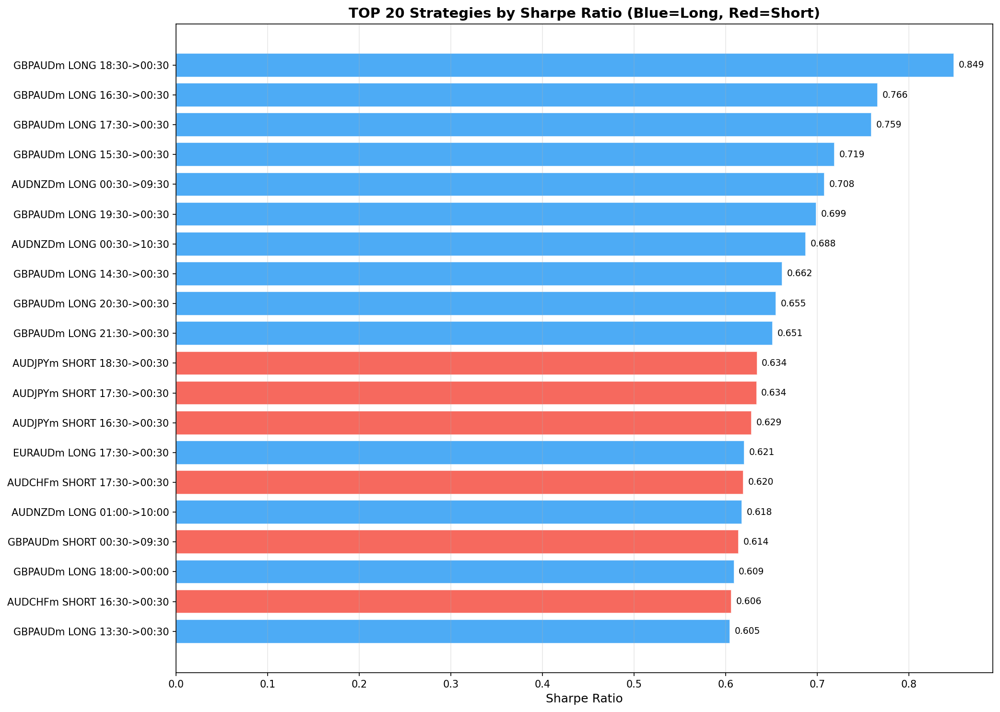

### Win Rate vs Sharpe Ratio
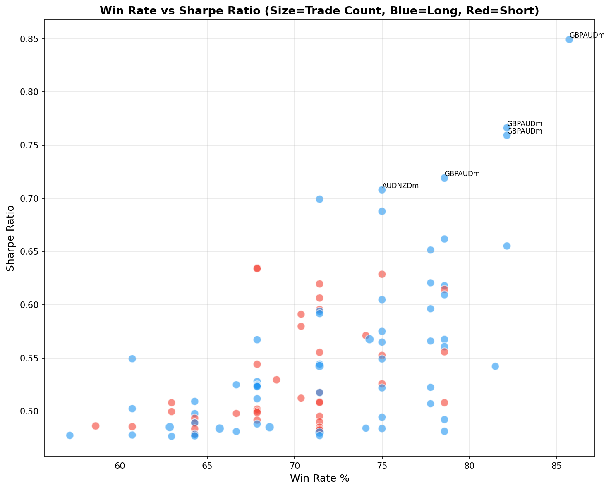

### Hold Hours Distribution
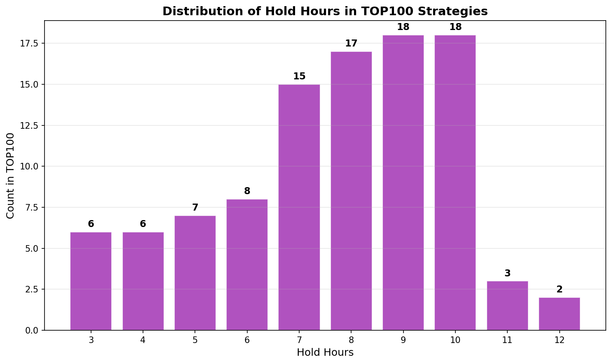

### Entry Time Distribution
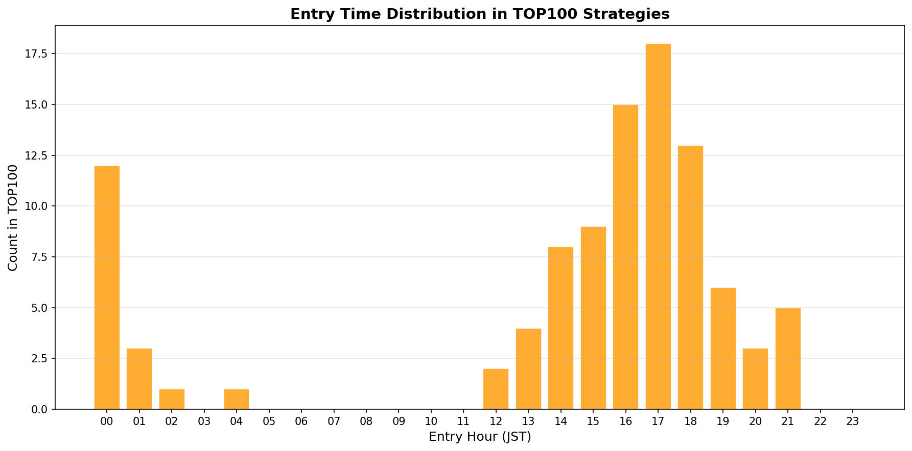

### Strategy Heatmap (Symbol x Direction)
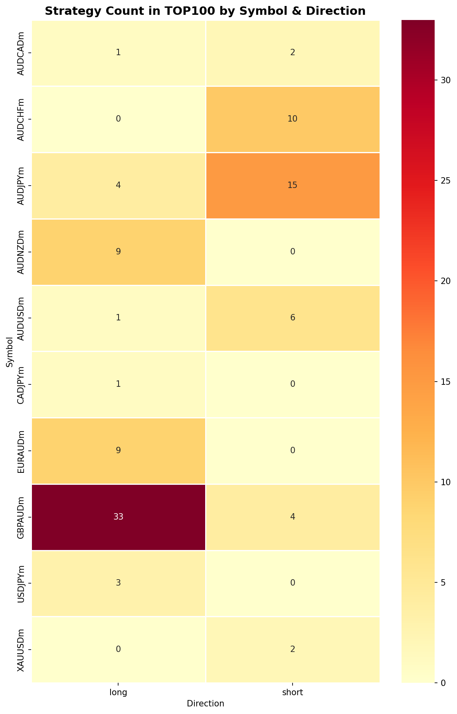

## TOP 10 Strategy Details

### #1 GBPAUDm LONG: 18:30 -> 00:30 (6h)

| Metric | Value |
|--------|-------|
| Sharpe Ratio | 0.849 |
| Win Rate | 85.7% |
| Avg Return | 0.2111% |
| Trades | 28 |
| Hold | 6h |

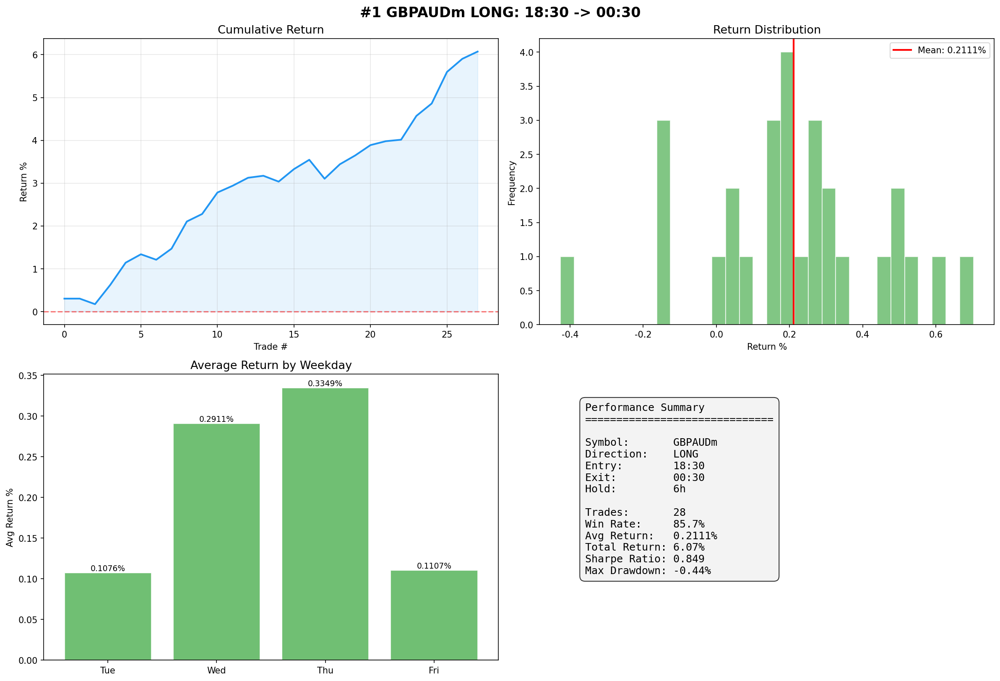

### #2 GBPAUDm LONG: 16:30 -> 00:30 (8h)

| Metric | Value |
|--------|-------|
| Sharpe Ratio | 0.766 |
| Win Rate | 82.1% |
| Avg Return | 0.2410% |
| Trades | 28 |
| Hold | 8h |

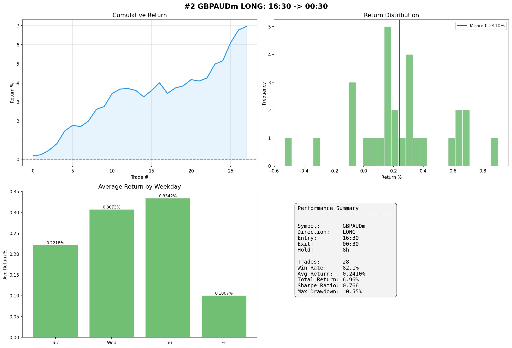

### #3 GBPAUDm LONG: 17:30 -> 00:30 (7h)

| Metric | Value |
|--------|-------|
| Sharpe Ratio | 0.759 |
| Win Rate | 82.1% |
| Avg Return | 0.2285% |
| Trades | 28 |
| Hold | 7h |

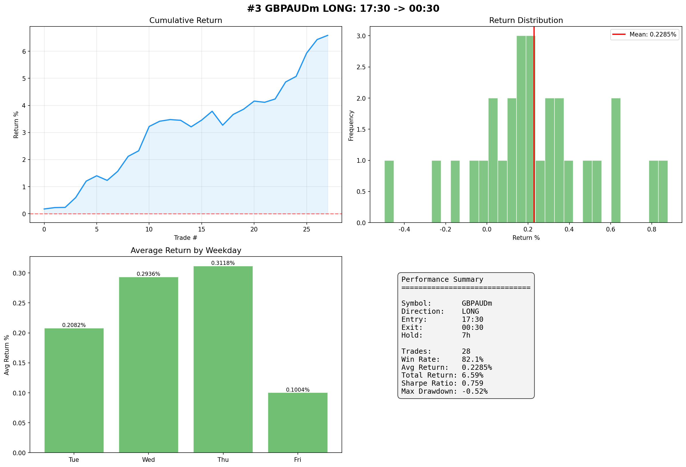

### #4 GBPAUDm LONG: 15:30 -> 00:30 (9h)

| Metric | Value |
|--------|-------|
| Sharpe Ratio | 0.719 |
| Win Rate | 78.6% |
| Avg Return | 0.2198% |
| Trades | 28 |
| Hold | 9h |

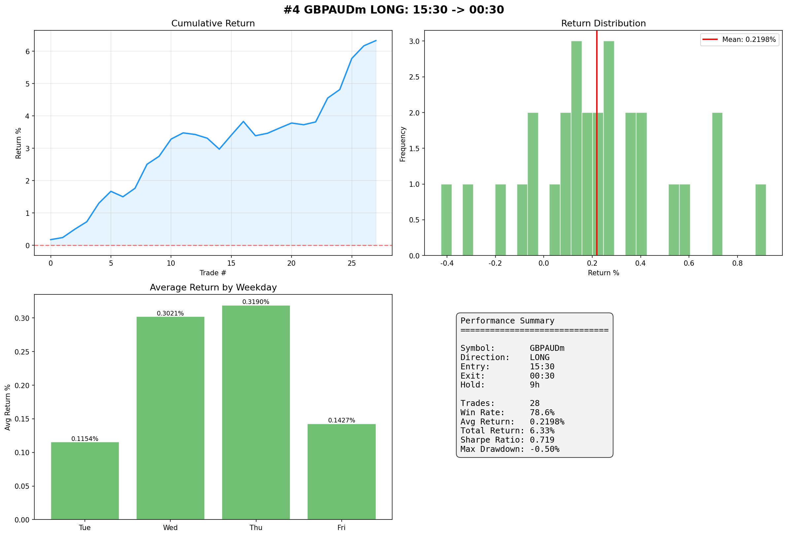

### #5 AUDNZDm LONG: 00:30 -> 09:30 (9h)

| Metric | Value |
|--------|-------|
| Sharpe Ratio | 0.708 |
| Win Rate | 75.0% |
| Avg Return | 0.0769% |
| Trades | 28 |
| Hold | 9h |

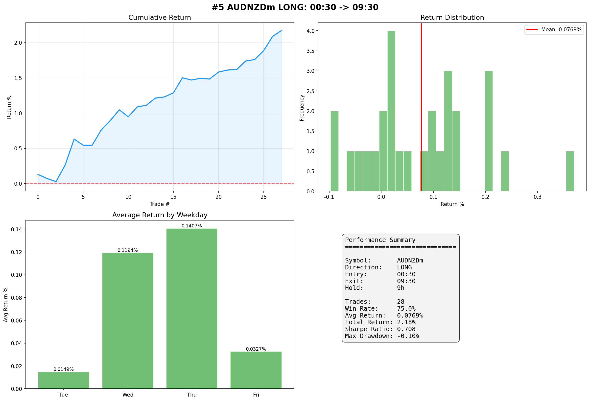

### #6 GBPAUDm LONG: 19:30 -> 00:30 (5h)

| Metric | Value |
|--------|-------|
| Sharpe Ratio | 0.699 |
| Win Rate | 71.4% |
| Avg Return | 0.1911% |
| Trades | 28 |
| Hold | 5h |

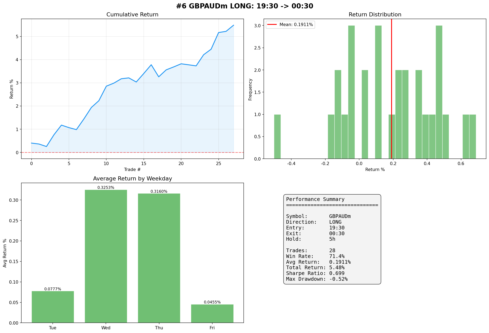

### #7 AUDNZDm LONG: 00:30 -> 10:30 (10h)

| Metric | Value |
|--------|-------|
| Sharpe Ratio | 0.688 |
| Win Rate | 75.0% |
| Avg Return | 0.1008% |
| Trades | 28 |
| Hold | 10h |

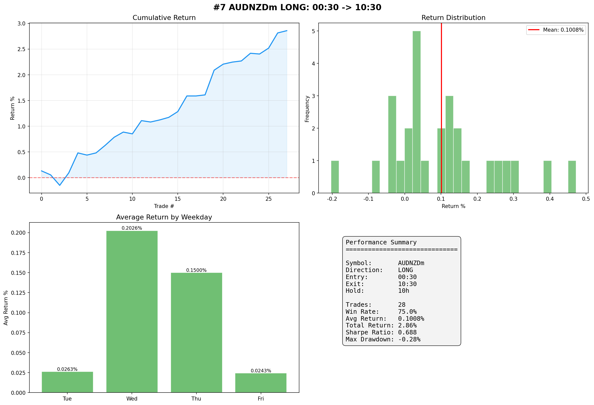

### #8 GBPAUDm LONG: 14:30 -> 00:30 (10h)

| Metric | Value |
|--------|-------|
| Sharpe Ratio | 0.662 |
| Win Rate | 78.6% |
| Avg Return | 0.2096% |
| Trades | 28 |
| Hold | 10h |

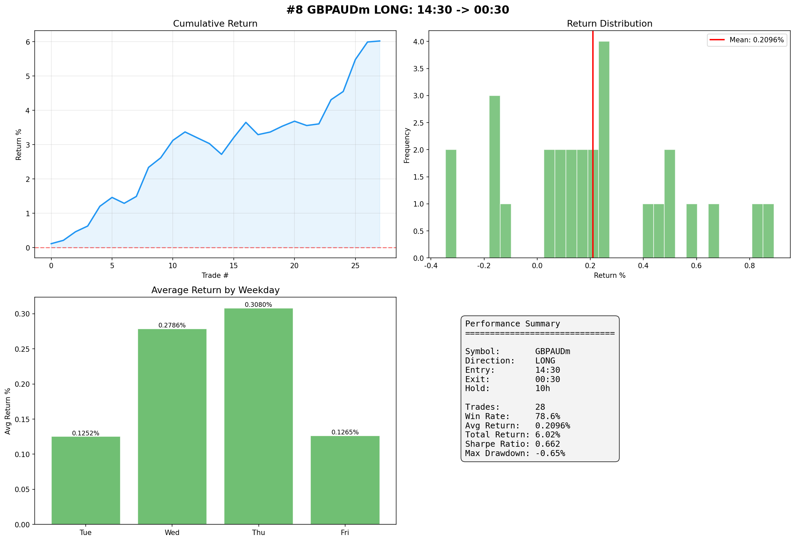

### #9 GBPAUDm LONG: 20:30 -> 00:30 (4h)

| Metric | Value |
|--------|-------|
| Sharpe Ratio | 0.655 |
| Win Rate | 82.1% |
| Avg Return | 0.1952% |
| Trades | 28 |
| Hold | 4h |

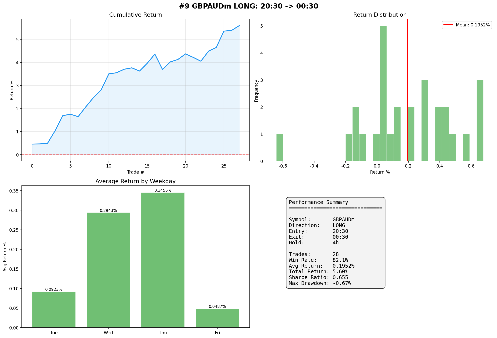

### #10 GBPAUDm LONG: 21:30 -> 00:30 (3h)

| Metric | Value |
|--------|-------|
| Sharpe Ratio | 0.651 |
| Win Rate | 77.8% |
| Avg Return | 0.2131% |
| Trades | 27 |
| Hold | 3h |

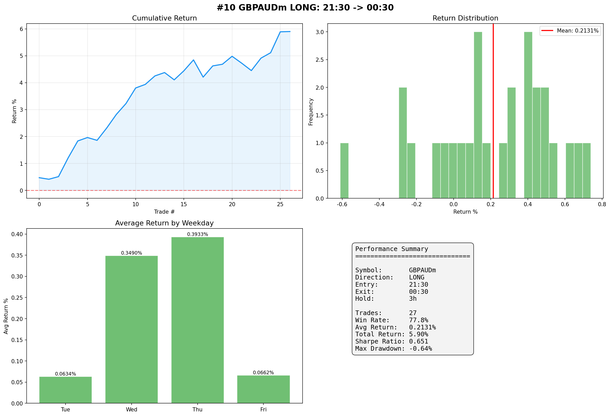

## TOP 100 Strategies Ranking

| Rank | Symbol | Dir | Entry | Exit | Hold | Trades | Win% | AvgReturn% | Sharpe |
|------|--------|-----|-------|------|------|--------|------|------------|--------|
| 1 | GBPAUDm | LONG | 18:30 | 00:30 | 6h | 28 | 85.7% | 0.2111% | 0.849 |
| 2 | GBPAUDm | LONG | 16:30 | 00:30 | 8h | 28 | 82.1% | 0.2410% | 0.766 |
| 3 | GBPAUDm | LONG | 17:30 | 00:30 | 7h | 28 | 82.1% | 0.2285% | 0.759 |
| 4 | GBPAUDm | LONG | 15:30 | 00:30 | 9h | 28 | 78.6% | 0.2198% | 0.719 |
| 5 | AUDNZDm | LONG | 00:30 | 09:30 | 9h | 28 | 75.0% | 0.0769% | 0.708 |
| 6 | GBPAUDm | LONG | 19:30 | 00:30 | 5h | 28 | 71.4% | 0.1911% | 0.699 |
| 7 | AUDNZDm | LONG | 00:30 | 10:30 | 10h | 28 | 75.0% | 0.1008% | 0.688 |
| 8 | GBPAUDm | LONG | 14:30 | 00:30 | 10h | 28 | 78.6% | 0.2096% | 0.662 |
| 9 | GBPAUDm | LONG | 20:30 | 00:30 | 4h | 28 | 82.1% | 0.1952% | 0.655 |
| 10 | GBPAUDm | LONG | 21:30 | 00:30 | 3h | 27 | 77.8% | 0.2131% | 0.651 |
| 11 | AUDJPYm | SHORT | 18:30 | 00:30 | 6h | 28 | 67.9% | 0.2658% | 0.634 |
| 12 | AUDJPYm | SHORT | 17:30 | 00:30 | 7h | 28 | 67.9% | 0.2803% | 0.634 |
| 13 | AUDJPYm | SHORT | 16:30 | 00:30 | 8h | 28 | 75.0% | 0.2904% | 0.629 |
| 14 | EURAUDm | LONG | 17:30 | 00:30 | 7h | 27 | 77.8% | 0.2094% | 0.621 |
| 15 | AUDCHFm | SHORT | 17:30 | 00:30 | 7h | 28 | 71.4% | 0.1791% | 0.620 |
| 16 | AUDNZDm | LONG | 01:00 | 10:00 | 9h | 28 | 78.6% | 0.0867% | 0.618 |
| 17 | GBPAUDm | SHORT | 00:30 | 09:30 | 9h | 28 | 78.6% | 0.1405% | 0.614 |
| 18 | GBPAUDm | LONG | 18:00 | 00:00 | 6h | 28 | 78.6% | 0.1901% | 0.609 |
| 19 | AUDCHFm | SHORT | 16:30 | 00:30 | 8h | 28 | 71.4% | 0.1839% | 0.606 |
| 20 | GBPAUDm | LONG | 13:30 | 00:30 | 11h | 28 | 75.0% | 0.1900% | 0.605 |
| 21 | EURAUDm | LONG | 16:30 | 00:30 | 8h | 27 | 77.8% | 0.2016% | 0.596 |
| 22 | GBPAUDm | SHORT | 00:30 | 10:30 | 10h | 28 | 71.4% | 0.1415% | 0.596 |
| 23 | AUDNZDm | LONG | 02:00 | 10:00 | 8h | 28 | 71.4% | 0.0788% | 0.594 |
| 24 | GBPAUDm | LONG | 18:00 | 01:00 | 7h | 28 | 71.4% | 0.1634% | 0.592 |
| 25 | AUDUSDm | SHORT | 16:30 | 00:30 | 8h | 27 | 70.4% | 0.2518% | 0.591 |
| 26 | AUDUSDm | SHORT | 17:30 | 00:30 | 7h | 27 | 70.4% | 0.2425% | 0.580 |
| 27 | AUDJPYm | LONG | 00:30 | 10:30 | 10h | 28 | 75.0% | 0.1514% | 0.575 |
| 28 | AUDUSDm | SHORT | 18:30 | 00:30 | 6h | 27 | 74.1% | 0.2213% | 0.571 |
| 29 | USDJPYm | LONG | 14:00 | 17:00 | 3h | 35 | 74.3% | 0.0786% | 0.568 |
| 30 | GBPAUDm | LONG | 17:00 | 00:00 | 7h | 28 | 78.6% | 0.2000% | 0.567 |
| 31 | GBPAUDm | LONG | 21:00 | 00:00 | 3h | 28 | 67.9% | 0.1831% | 0.567 |
| 32 | EURAUDm | LONG | 19:30 | 00:30 | 5h | 27 | 77.8% | 0.1781% | 0.566 |
| 33 | GBPAUDm | LONG | 16:00 | 01:00 | 9h | 28 | 75.0% | 0.1802% | 0.565 |
| 34 | GBPAUDm | LONG | 16:00 | 00:00 | 8h | 28 | 78.6% | 0.2070% | 0.561 |
| 35 | AUDCHFm | SHORT | 17:00 | 01:00 | 8h | 28 | 78.6% | 0.1661% | 0.556 |
| 36 | AUDJPYm | SHORT | 19:30 | 00:30 | 5h | 28 | 71.4% | 0.2392% | 0.555 |
| 37 | AUDJPYm | SHORT | 17:00 | 01:00 | 8h | 28 | 75.0% | 0.2635% | 0.552 |
| 38 | GBPAUDm | LONG | 18:30 | 01:30 | 7h | 28 | 60.7% | 0.1403% | 0.549 |
| 39 | GBPAUDm | LONG | 15:00 | 00:00 | 9h | 28 | 75.0% | 0.1867% | 0.549 |
| 40 | GBPAUDm | LONG | 17:00 | 01:00 | 8h | 28 | 71.4% | 0.1732% | 0.544 |
| 41 | AUDJPYm | SHORT | 17:00 | 02:00 | 9h | 28 | 67.9% | 0.2455% | 0.544 |
| 42 | USDJPYm | LONG | 13:30 | 16:30 | 3h | 35 | 71.4% | 0.0792% | 0.542 |
| 43 | EURAUDm | LONG | 18:30 | 00:30 | 6h | 27 | 81.5% | 0.1759% | 0.542 |
| 44 | XAUUSDm | SHORT | 16:30 | 00:30 | 8h | 29 | 69.0% | 0.8667% | 0.529 |
| 45 | GBPAUDm | LONG | 18:00 | 02:00 | 8h | 28 | 67.9% | 0.1514% | 0.528 |
| 46 | AUDJPYm | SHORT | 15:30 | 00:30 | 9h | 28 | 75.0% | 0.2211% | 0.526 |
| 47 | AUDNZDm | LONG | 00:00 | 10:00 | 10h | 27 | 66.7% | 0.0867% | 0.525 |
| 48 | GBPAUDm | LONG | 19:00 | 00:00 | 5h | 28 | 67.9% | 0.1661% | 0.525 |
| 49 | GBPAUDm | LONG | 19:00 | 01:00 | 6h | 28 | 67.9% | 0.1393% | 0.524 |
| 50 | GBPAUDm | LONG | 16:30 | 01:30 | 9h | 28 | 67.9% | 0.1702% | 0.524 |
| 51 | GBPAUDm | LONG | 15:00 | 01:00 | 10h | 28 | 67.9% | 0.1599% | 0.523 |
| 52 | EURAUDm | LONG | 15:30 | 00:30 | 9h | 27 | 77.8% | 0.1755% | 0.522 |
| 53 | GBPAUDm | LONG | 21:00 | 01:00 | 4h | 28 | 75.0% | 0.1564% | 0.522 |
| 54 | AUDCHFm | SHORT | 15:30 | 00:30 | 9h | 28 | 71.4% | 0.1543% | 0.518 |
| 55 | GBPAUDm | LONG | 17:30 | 01:30 | 8h | 28 | 71.4% | 0.1577% | 0.517 |
| 56 | AUDUSDm | SHORT | 15:30 | 00:30 | 9h | 27 | 70.4% | 0.2256% | 0.512 |
| 57 | GBPAUDm | LONG | 16:00 | 02:00 | 10h | 28 | 67.9% | 0.1683% | 0.512 |
| 58 | AUDNZDm | LONG | 01:30 | 10:30 | 9h | 28 | 64.3% | 0.0754% | 0.509 |
| 59 | AUDCHFm | SHORT | 18:30 | 00:30 | 6h | 28 | 71.4% | 0.1692% | 0.509 |
| 60 | GBPAUDm | SHORT | 00:30 | 11:30 | 11h | 28 | 71.4% | 0.1293% | 0.508 |
| 61 | AUDCADm | SHORT | 16:30 | 00:30 | 8h | 28 | 78.6% | 0.1701% | 0.508 |
| 62 | AUDJPYm | SHORT | 17:00 | 00:00 | 7h | 27 | 63.0% | 0.2682% | 0.508 |
| 63 | EURAUDm | LONG | 14:30 | 00:30 | 10h | 27 | 77.8% | 0.1787% | 0.507 |
| 64 | GBPAUDm | LONG | 21:00 | 02:00 | 5h | 28 | 60.7% | 0.1444% | 0.502 |
| 65 | AUDCHFm | SHORT | 14:30 | 00:30 | 10h | 28 | 67.9% | 0.1567% | 0.502 |
| 66 | GBPAUDm | SHORT | 00:30 | 12:30 | 12h | 28 | 67.9% | 0.1556% | 0.500 |
| 67 | AUDUSDm | SHORT | 13:30 | 00:30 | 11h | 27 | 63.0% | 0.2125% | 0.500 |
| 68 | AUDJPYm | SHORT | 16:30 | 01:30 | 9h | 28 | 67.9% | 0.2273% | 0.499 |
| 69 | AUDUSDm | SHORT | 14:30 | 00:30 | 10h | 27 | 66.7% | 0.2237% | 0.498 |
| 70 | GBPAUDm | LONG | 17:00 | 02:00 | 9h | 28 | 64.3% | 0.1613% | 0.498 |
| 71 | AUDCHFm | SHORT | 18:00 | 01:00 | 7h | 28 | 71.4% | 0.1510% | 0.495 |
| 72 | GBPAUDm | LONG | 14:00 | 00:00 | 10h | 28 | 75.0% | 0.1681% | 0.494 |
| 73 | AUDJPYm | SHORT | 17:00 | 03:00 | 10h | 28 | 64.3% | 0.2327% | 0.493 |
| 74 | AUDJPYm | LONG | 00:30 | 09:30 | 9h | 28 | 78.6% | 0.1351% | 0.492 |
| 75 | AUDJPYm | SHORT | 16:00 | 01:00 | 9h | 28 | 67.9% | 0.2066% | 0.492 |
| 76 | AUDCHFm | SHORT | 19:30 | 00:30 | 5h | 28 | 71.4% | 0.1618% | 0.490 |
| 77 | AUDJPYm | SHORT | 16:30 | 02:30 | 10h | 28 | 64.3% | 0.2355% | 0.489 |
| 78 | GBPAUDm | LONG | 20:00 | 00:00 | 4h | 28 | 64.3% | 0.1519% | 0.489 |
| 79 | AUDNZDm | LONG | 04:00 | 10:00 | 6h | 28 | 67.9% | 0.0645% | 0.488 |
| 80 | XAUUSDm | SHORT | 17:30 | 00:30 | 7h | 29 | 58.6% | 0.8239% | 0.486 |
| 81 | AUDJPYm | SHORT | 18:30 | 01:30 | 7h | 28 | 60.7% | 0.2027% | 0.485 |
| 82 | AUDJPYm | LONG | 12:00 | 17:00 | 5h | 35 | 62.9% | 0.1439% | 0.485 |
| 83 | AUDCHFm | SHORT | 16:00 | 01:00 | 9h | 28 | 71.4% | 0.1451% | 0.485 |
| 84 | USDJPYm | LONG | 13:30 | 17:30 | 4h | 35 | 68.6% | 0.0858% | 0.485 |
| 85 | EURAUDm | LONG | 20:30 | 00:30 | 4h | 27 | 74.1% | 0.1646% | 0.484 |
| 86 | CADJPYm | LONG | 14:00 | 17:00 | 3h | 35 | 65.7% | 0.0657% | 0.484 |
| 87 | EURAUDm | LONG | 18:00 | 01:00 | 7h | 28 | 75.0% | 0.1531% | 0.484 |
| 88 | AUDJPYm | SHORT | 18:00 | 01:00 | 7h | 28 | 64.3% | 0.2285% | 0.483 |
| 89 | AUDJPYm | SHORT | 17:30 | 01:30 | 8h | 28 | 71.4% | 0.2172% | 0.483 |
| 90 | AUDCADm | SHORT | 17:30 | 00:30 | 7h | 28 | 71.4% | 0.1652% | 0.482 |
| 91 | EURAUDm | LONG | 17:00 | 01:00 | 8h | 28 | 78.6% | 0.1670% | 0.481 |
| 92 | GBPAUDm | LONG | 21:30 | 01:30 | 4h | 27 | 66.7% | 0.1489% | 0.481 |
| 93 | AUDJPYm | LONG | 14:00 | 17:00 | 3h | 35 | 71.4% | 0.0997% | 0.480 |
| 94 | AUDCHFm | SHORT | 15:00 | 01:00 | 10h | 28 | 64.3% | 0.1393% | 0.479 |
| 95 | AUDNZDm | LONG | 01:00 | 11:00 | 10h | 28 | 64.3% | 0.0787% | 0.478 |
| 96 | AUDCADm | LONG | 00:30 | 10:30 | 10h | 28 | 60.7% | 0.0973% | 0.478 |
| 97 | AUDNZDm | LONG | 00:30 | 08:30 | 8h | 28 | 57.1% | 0.0465% | 0.477 |
| 98 | GBPAUDm | LONG | 12:30 | 00:30 | 12h | 28 | 71.4% | 0.1403% | 0.477 |
| 99 | GBPAUDm | LONG | 15:30 | 01:30 | 10h | 28 | 64.3% | 0.1490% | 0.477 |
| 100 | AUDUSDm | LONG | 00:30 | 10:30 | 10h | 27 | 63.0% | 0.1575% | 0.476 |

## Summary by Symbol

| Symbol | Strategies in TOP100 | Best Sharpe | Best Direction |
|--------|---------------------|-------------|----------------|
| GBPAUDm | 37 | 0.849 | LONG |
| AUDNZDm | 9 | 0.708 | LONG |
| AUDJPYm | 19 | 0.634 | SHORT |
| EURAUDm | 9 | 0.621 | LONG |
| AUDCHFm | 10 | 0.620 | SHORT |
| AUDUSDm | 7 | 0.591 | SHORT |
| USDJPYm | 3 | 0.568 | LONG |
| XAUUSDm | 2 | 0.529 | SHORT |
| AUDCADm | 3 | 0.508 | SHORT |
| CADJPYm | 1 | 0.484 | LONG |

---
*This report was auto-generated by the FX Anomaly Search System.*